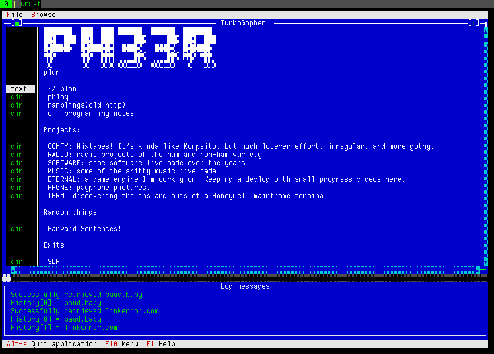

# What is this?

If you're old (or curious) enough to have used Turbo Pascal 7 back in the day
for dos, you probably used the blue-background IDE it came with. This IDE was
written using the TurboVision Text-User-Interface (TUI) framework.
It was really quite nifty and ahead of it's time. It was a fully object-oriented
framework for creating text-based user interfaces, with lots of extra fancy 
features. Unlike low-level curses, TV could do window management for you, and 
easily would let you create draggable/resizable windows with all kinds of widgets
on them. It even had input validation functionality for controls and such.

I always had fond memories using the Turbo Pascal IDE from back then, and other
TurboVision applications, so I figured, why not browse GopherSpace in it?

FreePascal (a modern Free pascal implementation) comes with FreeVision, which
is a Turbo-Vision compatible implementation, which is what I ended up using
here.

TV does have some old-age problems, like lack of UTF-8 support, and only
supporting 16 colors (like really,... they coded the fg/bg color of stuff
as the hi and lo nibbles of a byte).

In theory this stuff should compile on platforms other that Linux (Maybe even
DOS?), but I haven't tried yet at the time of writing.

# What's it look like?

It looks like a typical TurboVision app!

# How do I use it?

So far, the following keyboard shortcuts are supported:

* Alt+g ( Or via the menu Browse->Go )  - opens up a dialog to enter a url to browse to.
* Arrow keys + PgUp/PgDwn - Navigate the text on the page.
* Alt+up - Select previous link
* Alt+down - Select next link.
* Alt+left - Back.
* Alt+right - Forward.

# How do i build & run it

At the time of writing, I still have to put up a build toolchain with proper build scripts
and such for building outside of Lazarus.

So to build it right now, you have to open the turbogopher.lpi file with lazarus and build with shift+f9
This should produce an executable in the project root directory that you can run from a terminal.
Don't run it from within lazarus, because it doesn't know how to handle console stuff.

# FILES

The only relevant file right now is /tmp/turbogopher_debug.txt which should contain the last
log line (for debugging) - this will go away / be configurable eventually.

# TODO

(very) basic browsing works, but a lot of work is left:

* (essential) Opening non-text links and associated mime type handling.
* (essential) Opening search links / stuff that takes user input.
* (feature) A lot of configuration dialogs to allow configuration of keybindings, colors, logfile, loglevel, etc,...
* (improvement) Better UTF-8 to Ansi conversion.
* (essential) Add make scripts for people to build this without lazarus. Add packaging stuff, release pipeline stuff.
* (FV bug?) Application does not resize when terminal is resized.
* (feature) History menu and/or window.
~~* (feature) ability to download/save pages.~~ (Implemented Jul 16 2021)

